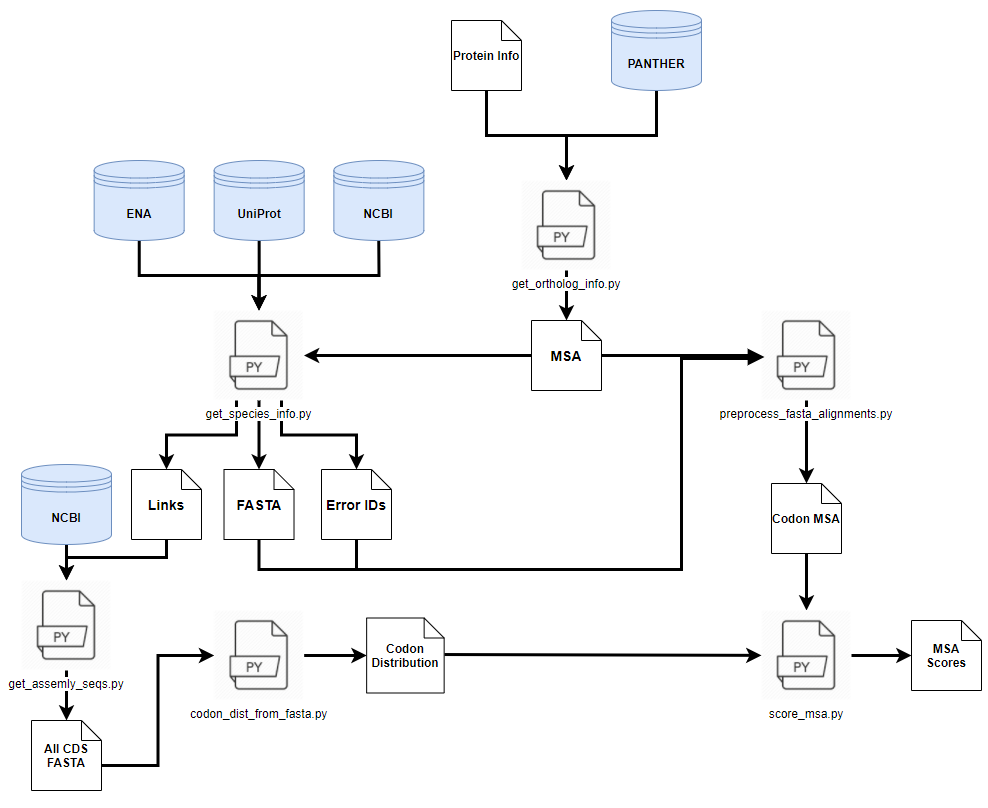

# Codon-Usage-IDRs

Codon-Usage-IDRs is a repository storing the pipeline used in my basic analysis of the conservation of codon usage bias in Intrinsically Disordered Regions.

## Python Packages Used

A number of python packages were used in this pipeline:
  1. Biopython (v1.72)
  1. Bioservices (v1.7.4)
  1. Numpy (v1.15.4)
  1. Pandas (v0.24.2)
  1. Matplotlib (v3.0.2)


## Other Software Used

VSL2 - Used to predict protein disorder. (installation below)

[Jupyter Notebook](https://jupyter.org/install) - Used to visualize and analyze data.

## VSL2 Installation

This module cannot be installed using pip. To install, use the provided setup.py file by following these steps:

1. Make sure you have the most up-to-date version of setuptools:

```bash
python -m pip install --upgrade setuptools
```

1. Path to the directory where the VSL2 setup.py file is located:
```bash
cd <directory>
```

1. Run the setup.py file:
```bash
python setup.py install
```

## Databases Accessed

[PANTHER](http://pantherdb.org/) was used to retrieve orthologs and the family multiple sequence alignment.

[UniProt](https://www.uniprot.org/) was used to retrieve each ortholog’s taxonomy IDs and EMBL coding sequence accession numbers.

[European Nucleotide Archive (ENA)](https://www.ebi.ac.uk/ena/browser/home) was used to retrieve the orthologs’ coding sequences.

[National Center for Biotechnology Information (NCBI)](https://www.ncbi.nlm.nih.gov/) was used to retrieve all protein coding sequences for an organism.


## Pipeline Visualization



## Individual Program Usage

All programs in the pipeline are command-line compatible. Each program's description, required input, and outputs are provided below.
* <ins>get_ortholog_info.py</ins>:

  * <ins>Description</ins>: Retrieve orthologs and their respective family multiple sequence alignments for each protein.
  
  * <ins>Input Files</ins>: CSV file with one or more sets of UniProt IDs, PANTHER Family IDs, and Taxonomy IDs, in that order.
  
  * <ins>Output</ins>: A text file of multiple sequence alignments in FASTA format.

* <ins>get_species_info_by_uid.py</ins>:

  * <ins>Description</ins>: Retrieve taxonomy ID's and coding sequences. Filter out any protein with incomplete information.
  
  * <ins>Input Files</ins>: A text file of multiple sequence alignments in FASTA format where UniProtKB IDs are the headers.
  
  * <ins>Output</ins>: 1) CSV file containing partial links to the NCBI FTP server, and the corresponding taxonomy ID. 2) FASTA file of all DNA coding sequences from input list. 3) Error Log text file recording which proteins were removed.

* <ins>get_assembly_seqs_from_ftp.py</ins>:

  * <ins>Description</ins>: Download file from NCBI FTP that contains all the protein coding sequences in an organism.
  
  * <ins>Input Files</ins>: CSV file containing partial links to the NCBI FTP server, and the corresponding taxonomy ID.
  
  * <ins>Output</ins>: FASTA file containing all protein coding sequences for an organism.
  
* <ins>codon_dist_from_fasta.py</ins>:

  * <ins>Description</ins>: Create CSV file(s) containing the codon distributions for: 1) Entire Organism (-o option) 2) Each gene in each FASTA file (-m option).
  
  * <ins>Input Files</ins>: FASTA file containing all protein coding sequences for an organism.
  
  * <ins>Output</ins>: CSV file(s) containing codon distribution, formatted as "codon,amino acid"
  
  
* <ins>get_distributions.sh</ins>:

  * <ins>Description</ins>: Allows for use of codon_dist_from_fasta.py in many subdirectories
  
  * <ins>Input Files</ins>: N/A
  
  * <ins>Output</ins>: N/A
  

* <ins>preprocess_fasta_alignments.py</ins>:

  * <ins>Description</ins>: Validates and translates protein sequence to DNA sequence.
  
  * <ins>Input Files</ins>: 1) A text file of multiple sequence alignments in FASTA format. 2) Error Log text file recording which proteins were removed from the multiple sequence alignment.
  
  * <ins>Output</ins>: A text file of DNA multiple sequence alignments in FASTA format.
  
* <ins>score_msa.py</ins>:

  * <ins>Description</ins>: Score a DNA multiple sequence alignment for 3 features: Conservation, Codon Usage, and Disorder.
  
  * <ins>Input Files</ins>: A text file of DNA multiple sequence alignments in FASTA format.
  
  * <ins>Output</ins>: A DATA file with per column scores for each score used to extract the 3 features.
  
* <ins>Jupyter Notebook Files</ins>:

  * <ins>Description</ins>: Analyze and visualize DATA file.
  
  * <ins>Input Files</ins>: A DATA file with per column scores for each score used to extract the 3 features.
  
  * <ins>Output</ins>: Inline figures and tables.

## Programs Not Used Directly in Pipeline

Three programs in this repository were not directly used in the pipeline. Their functions are described below.

* <ins>calc_gene_overall_percent_disorder.py</ins>:
  
  * <ins>Description</ins>: A command-line compatible program that predicts overall percent disorder of a list of genes using VSL2.
  
  * <ins>Input Files</ins>: Can either be: 1) A text file of UniProtKB IDs 2) A FASTA file of DNA sequences
  
  * <ins>Output</ins>: CSV file containing each gene's predicted overall percent disorder.
  
* <ins>codon_dist.py</ins>:
 
  * <ins>Description</ins>: This file is used as a module in multiple scripts in the pipeline.
  
* <ins>get_stats.py</ins>:
 
  * <ins>Description</ins>: This file is used as a module in codon_dist.py


